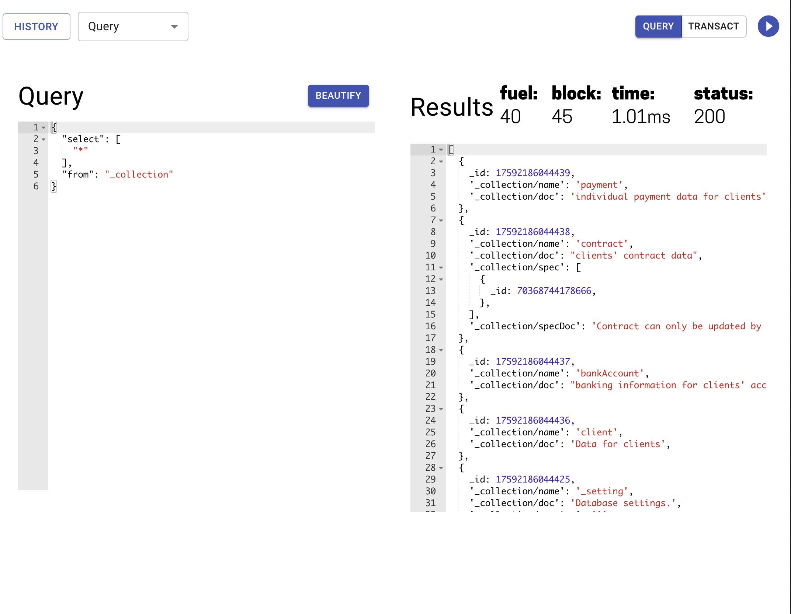

# @fluree/admin-react

> Made with create-react-library

[](https://www.npmjs.com/package/@fluree/admin-react) [](https://typescriptlang.com)

## Install

```bash
npm install --save @fluree/admin-react
```

## Components

### FlureeQL

#### Example



```javascript
import { FlureeQL } from 'fluree-admin-components'

const App = () => {
  return (
    <FlureeQL
      allowTransact
      _db={{
        db: 'example/mdm',
        ip: 'http://localhost:8090',
        dbs: ['example/mdm']
      }}
    />
  )
}
```

Contains everything you need to get started querying and transacting against your Fluree ledger using the FlureeQL query language. Currently supports unsigned queries (including `block`, `history`, and `multi-query`) and transactions.

#### Props

| Prop          | Required ? | Type            | Default   | Description                                                  |
| ------------- | ---------- | --------------- | --------- | ------------------------------------------------------------ |
| \_db          | ✅         | object          |           | Object containing Fluree ledger data (detailed below)        |
| allowTransact |            | boolean         | false     | If set to `true`, user can make transactions to ledger       |
| withHistory   |            | boolean         | false     | If set to `true`, History component is available             |
| jsonMode      |            | 'json', 'json5' | 'json'    | Determines Editor syntax features (linting / beautification) |
| token         |            | string (JWT)    | undefined | A JWT token to pass into HTTP requests                       |
| allowKeyGen   |            | boolean         | false     | Allow access to Public/Private Key Generation functionality  |
| allowSign     |            | boolean         | false     | Allow for signing queries with private key                   |

##### `_db` Object

| key | value                        | type   |
| --- | ---------------------------- | ------ |
| db  | ledger name                  | string |
| ip  | base url for Fluree instance | string |


## License

© Fluree, PBC
